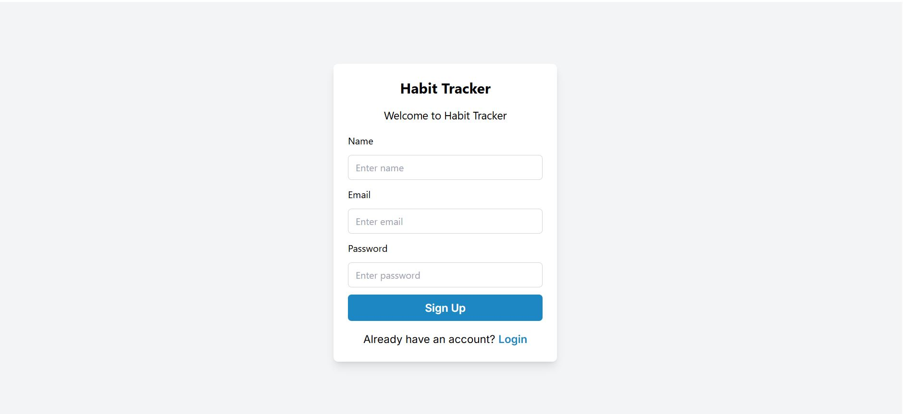
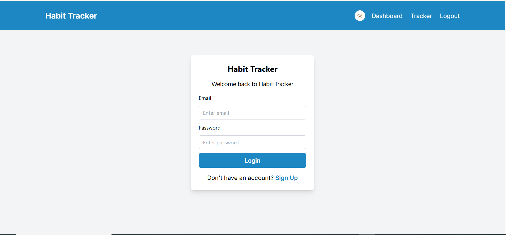
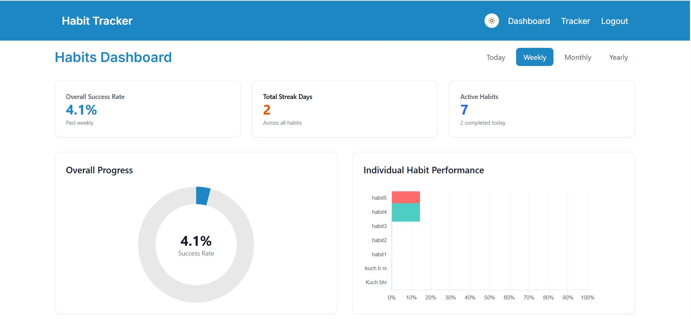
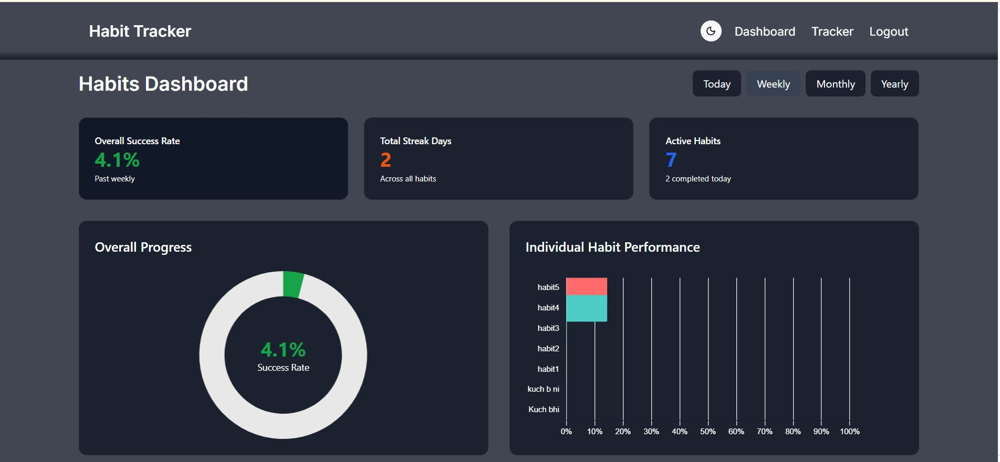
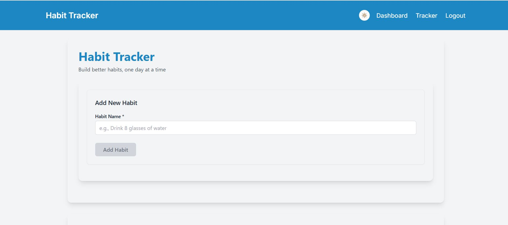
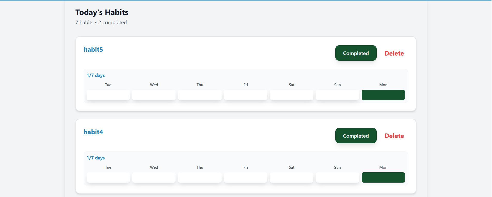

# Habit Tracker 

A full-stack **habit tracking app** built with **React, Tailwind, Node.js, Express, and MongoDB**.  
Users can track daily habits, visualize progress with charts, maintain streaks, and stay consistent.

---

##  Features

- Add, delete daily habits (e.g., *Drink Water 8x*, *Read 20 min*)  
- Authentication with JWT (Register/Login)  
- Track daily completions and streaks  
- Dashboard with streaks, success rate, and charts  
- Mobile-first responsive UI with Tailwind CSS   
- Dark mode toggle 
- Fully deployed on Vercel (frontend) + Railway/Render (backend)  

---

## Screenshots
### Signup

### Authentication

### Habit Dashboard

### Habit Tracker

---

## Tech Stack

### Frontend
- React (Vite)
- Tailwind CSS
- Axios

### Backend
- Node.js + Express
- MongoDB + Mongoose
- JWT Authentication
- CORS, dotenv, bcrypt

### Deployment
- Frontend → Vercel
- Backend → Railway/Render
- Database → MongoDB Atlas
---

## Deployed
You can view the deployed app [here](https://habit-tracker-3iksch2mi-nasreens-projects-bbb8a391.vercel.app/).

